# A real data analysis and modeling project - restaurant inspections
Jafar Pourbemany
9/27/2021

This project represents data analysis and modeling of restaurant inspections that took place in the Las Vegas metropolitan area. The original source of the data is located at the [City of Las Vegas Open Data Portal](https://opendataportal-lasvegas.opendata.arcgis.com/datasets/restaurant-inspections-open-data). Inspections are performed using a [Food Establishment Inspection Report](https://www.southernnevadahealthdistrict.org/download/eh/fe-inspection-report.pdf).
For this project, you will work on two subsets of this data that have been manipulated for this exercise: TRAIN_SET_2021.csv and TEST_SET_2021.csv. 

## Project summary
The main goal of this project is to explore the possibility of building a minimally viable product (MVP) model to predict the outcome of a restaurant's next inspection based on the provided data of previous inspection in Nevada. The first step is to analyze the provided information and interperate all the information. Then we need to select important features and perform data cleaning and preprocessing. Afterward, we should find the best classifier to create a model and predict the outcomes.

## Provided information
1- A dataset for training the classifier (TRAIN_SET_2021.csv)

2- A dataset on which the model should be applied (TEST_SET_2021.csv)

3- Inspection form (fe-inspection-report.pdf)

4- Instructions (Open-Ended Modeling Assessment.pdf)

## Tasks
1- Conduct exploratory data analysis of the Training Set. Provide an overview of the data set and underlying patterns you may identify. Without a thorough data dictionary, you may have to make some assumptions about the data. 

2- Attempt to build an MVP model that predicts the outcome of a restaurant's next inspection, using NEXT_INSPECTION_GRADE_C_OR_BELOW as the response - General restaurant information and data from the restaurant's most recent inspection has been provided. Determine if an MVP model can be built using the available data. 

3- Apply a couple of models to the test set - Predict NEXT_INSPECTION_GRADE_C_OR_BELOW for the data in the TEST_SET_2021.csv file.

4- For your selected model, save your predictions to a CSV file, with only comma delimiters. The file should include only three columns: RESTAURANT_SERIAL_NUMBER, CLASSIFIER_PROBABILITY, and CLASSIFIER_PREDICTION. The serial number should be a character data type and the predictions should have real values.

5- Provide recommendations for how you would enhance the data set to improve the predictive power of the model - Assume "the sky's the limit." 

## Data analysis
Based on the inspection form, restaurants may commit multiple violations in each inspection. There are 4 different violation categories; Imminent Health Hazard, critical, major, and noon-major. The demerit's number varies based on the importance of the violation categories. The inspections can categorized as routine inspection and re-inspection. Each inspection has a grade based on demerits and consecutive violations as explained in the inspection form.

Analyzing the Train_set, there are 17 features that can affect the prediction results. 

```Python
identifier_feature = ['RESTAURANT_SERIAL_NUMBER']
continuous_features = ['MEDIAN_EMPLOYEE_AGE', 'MEDIAN_EMPLOYEE_TENURE']
nominal_features = ['RESTAURANT_CATEGORY', 'CITY', 'STATE', 'CURRENT_GRADE',
                    'INSPECTION_TYPE','FIRST_VIOLATION', 'SECOND_VIOLATION',
                    'THIRD_VIOLATION','FIRST_VIOLATION_TYPE','SECOND_VIOLATION_TYPE','THIRD_VIOLATION_TYPE']
numeric_feactures = ['CURRENT_DEMERITS', 'EMPLOYEE_COUNT', 'INSPECTION_DEMERITS',
                     'NUMBER_OF_VIOLATIONS']
target = ['NEXT_INSPECTION_GRADE_C_OR_BELOW']
selected_features = nominal_features+ numeric_feactures+ continuous_features+ target
```

Using Python 3.7, we can import the file TRAIN_SET_2021.csv and get data type of each feature.   
```
RESTAURANT_CATEGORY                  object
CITY                                 object
STATE                                object
CURRENT_DEMERITS                    float64
CURRENT_GRADE                        object
EMPLOYEE_COUNT                      float64
MEDIAN_EMPLOYEE_AGE                 float64
MEDIAN_EMPLOYEE_TENURE              float64
INSPECTION_TYPE                      object
INSPECTION_DEMERITS                  object
FIRST_VIOLATION                     float64
SECOND_VIOLATION                    float64
THIRD_VIOLATION                     float64
FIRST_VIOLATION_TYPE                 object
SECOND_VIOLATION_TYPE                object
THIRD_VIOLATION_TYPE                 object
NUMBER_OF_VIOLATIONS                 object
```
Then look for null values. All the features have some null value. One option is to ignore them and use all the features for predicting. But, some features (e.g., MEDIAN_EMPLOYEE_AGE and MEDIAN_EMPLOYEE_TENURE) may have not significant effect on the outcome, so ignoring them with their null values may lead to a better model (because we will have more data for training the model). Hence, I also used the Orange software to quickly evaluate their importance on the classifier. Finally, you can see that keeping them can lead to a slightly better results. Therefore, we need to drop the rows with null values in the selected features. 

```
RESTAURANT_SERIAL_NUMBER              0
RESTAURANT_CATEGORY                 130
CITY                                236
STATE                               209
CURRENT_DEMERITS                    216
CURRENT_GRADE                       308
EMPLOYEE_COUNT                       93
MEDIAN_EMPLOYEE_AGE                  34
MEDIAN_EMPLOYEE_TENURE              297
INSPECTION_TYPE                     221
INSPECTION_DEMERITS                 254
FIRST_VIOLATION                     212
SECOND_VIOLATION                     85
THIRD_VIOLATION                      61
FIRST_VIOLATION_TYPE                146
SECOND_VIOLATION_TYPE               267
THIRD_VIOLATION_TYPE                173
NUMBER_OF_VIOLATIONS                169
NEXT_INSPECTION_GRADE_C_OR_BELOW     40
```
Afterward, we should searched the data to find the outliers. We can count the unique values in each feature.
```
RESTAURANT_CATEGORY
Restaurant                     9316
Bar / Tavern                   2369
Snack Bar                      1285
Special Kitchen                1158
Buffet                          228
Portable Unit                   199
Pantry                          165
Meat/Poultry/Seafood            140
NaN                             130
Food Trucks / Mobile Vendor      99
Caterer                          71
Banquet Kitchen                  65
Kitchen Bakery                   60
Garde Manger                     47
Bakery Sales                     47
Vegetable Prep                   44
Produce Market                   33
Institutional Food Service       32
Concessions                      29
Confection                       26
Elementary School Kitchen        20
Grocery Store Sampling           19
Banquet Support                  16
Childcare Kitchens               15
Portable Bar                     15
Barbeque                         14
Gastropub                         9
Main Kitchen                      8
Gas Station                       8
Beer Bar                          3
Farmers Market                    2
Self-Service Food Truck           1
```
```
CITY
Las Vegas                12352
Henderson                 1511
North Las Vegas            895
NaN                        236
Laughlin                   196
Mesquite                   159
Boulder City               132
Primm                      103
Searchlight                 13
Logandale                   11
Indian Springs              11
Overton                     10
New York                     9
Saskatoon                    8
Blue Diamond                 5
Moapa                        4
Jean                         3
Goodsprings                  2
Sandy Valley                 2
HendeSON                     2
Cal-Nev-Ari                  2
Miami                        1
Deep Space Nine              1
HENDERSON                    1
Truth or Consequences        1
Walla Walla                  1
Port of Spain                1
Jellystone Park              1
```
You can see that there are some non-alphabetic character need to be removed from STATE feature (e.g., in Nevada?). Also, the difference between the same words with capital and small letters need to be handled. Since we are working on the inspection results of Nevada, other states are like outlier and need to be removed. 
```
STATE
Nevada        15437
NaN             209
New York          9
SK                8
Nevada?           1
NEVADA            1
Florida           1
New Mexico        1
TT                1
Montana           1
Star Trek         1
NeVaDa            1
Nevada!           1
Washington        1
```

CURRENT_GRADE should be A, B, C, X, or O. So, all others are outliers.

```
CURRENT_GRADE
A             14915
NaN             308
B               215
C               104
X                75
O                32
N                13
7                 2
.\<><1@#&|        1
VPN               1
K                 1
EIEIO             1
U                 1
I                 1
A+                1
NASA              1
UPN               1
```
Also, there are some outliers in the feature INSPECTION_TYPE.
```
INSPECTION_TYPE
Routine Inspection                     14581
Re-inspection                            867
NaN                                      221
Routine Non-Inspection                     2
This Value Intentionally Left Blank        1
9/20/2011 14:25                            1
```
Outliers in FIRST_VIOLATION, SECOND_VIOLATION, and THIRD_VIOLATION can be removed by applying a filter.
```
FIRST_VIOLATION
202.0        2869
209.0        1467
211.0        1436
214.0        1211
206.0         971

301.0           3
17.0            2
15.0            2
3.0             1
8675309.0       1
```

```
SECOND_VIOLATION
211.0    1602
209.0    1433
215.0    1180
214.0    1136
212.0     903

15.0        2
10.0        2
8.0         1
301.0       1
61.0        1
```

```
THIRD_VIOLATION
215.0    1382
211.0    1116
233.0    1113
230.0     862
213.0     785

309.0       1
61.0        1
62.0        1
306.0       1
39.0        1
```
FIRST_VIOLATION_TYPE, SECOND_VIOLATION_TYPE, and THIRD_VIOLATION_TYPE should have four values Imminent Health Hazard, Critical, Major, and Non-Major. 
```
FIRST_VIOLATION_TYPE
Critical                  7194
Major                     6735
Non-Major                 1588
NaN                        146
Imminent Health Hazard       3
Radical                      1
Major-ish                    1
Not Sure                     1
Bullwinkle                   1
Excellent                    1
To Infinity and Beyond       1
Extra Crispy                 1
```

```
SECOND_VIOLATION_TYPE
Major                     7908
Non-Major                 4507
Critical                  2984
NaN                        267
Imminent Health Hazard       5
Supercritical                1
Kitchen Nightmares           1
```

```
THIRD_VIOLATION_TYPE
Major                     7310
Non-Major                 7286
Critical                   867
NaN                        173
Imminent Health Hazard      37
```
Negative and extremely large demerits are outliers in the features CURRENT_DEMERITS and EMPLOYEE_COUNT.
```
CURRENT_DEMERITS
 0.000       3935
 3.000       3121
 8.000       2439
 6.000       2208
 9.000       1871
 5.000        765
 10.000       451
 NaN          216
 7.000        111
 19.000        73
 4.000         60
 20.000        50
 1.000         48
 2.000         35
 14.000        35
 17.000        23
 11.000        16
 27.000        16
 12.000        15
 25.000        13
 22.000        13
 32.000        13
 16.000        12
 18.000        11
 31.000        10
 46.000         9
 30.000         9
 23.000         8
 100.000        8
 13.000         7
 42.000         7
 51.000         7
 39.000         6
 35.000         6
 24.000         6
 26.000         6
 38.000         5
 28.000         5
 15.000         5
 43.000         3
 21.000         2
 37.000         1
 987.000        1
 3.140          1
 1.414          1
 48.000         1
 88.000         1
-8.000          1
 89.000         1
 2.200          1
 33.000         1
 98.000         1
 363.000        1
 87.000         1
 1214.000       1
```

```
EMPLOYEE_COUNT
 3.0         2148
 14.0         643
 13.0         632
 11.0         622
 15.0         619
 18.0         605
 17.0         596
 16.0         593
 12.0         585
 10.0         574
 19.0         548
 9.0          525
 8.0          511
 22.0         490
 21.0         472
 20.0         468
 7.0          451
 6.0          435
 5.0          416
 23.0         414
 24.0         401
 25.0         362
 4.0          359
 26.0         345
 27.0         274
 28.0         226
 29.0         226
 30.0         176
 31.0         168
 32.0         132
 33.0         117
 34.0         104
 NaN           93
 35.0          78
 37.0          44
 38.0          42
 39.0          38
 36.0          35
 40.0          20
 41.0          20
 42.0          18
 43.0          16
 44.0           8
 47.0           6
 45.0           5
 52.0           3
 48.0           2
 46.0           2
 687.0          1
-7.0            1
 53.0           1
 111447.0       1
 49.0           1
 902.0          1
```
Non-numeric values (e.g., "Routine Inspection" and "Nevada") are outliers for the features INSPECTION_DEMERITS and NUMBER_OF_VIOLATIONS.
```
INSPECTION_DEMERITS
10                    1911
9                     1792
7                     1155
19                    1148
20                    1141

86                       1
60                       1
Routine Inspection       1
70                       1
62                       1
```

```
NUMBER_OF_VIOLATIONS
3         3718
4         3489
5         2006
6         1726
7         1231
8          991
9          631
10         487
11         332
12         273
13         192
NaN        169
14         132
15         105
16          69
17          40
18          27
19          17
20           9
22           6
23           6
21           5
24           4
25           4
30           1
42           1
28           1
Nevada       1
```
There is no outlier for MEDIAN_EMPLOYEE_AGE and MEDIAN_EMPLOYEE_TENURE.
```
MEDIAN_EMPLOYEE_AGE
18.000000    347
NaN           34
27.020983      1
22.749690      1
26.925228      1

27.894062      1
22.181251      1
32.127664      1
28.024775      1
23.186349      1
```

```
MEDIAN_EMPLOYEE_TENURE
NaN         297
2.768834      1
4.013901      1
4.622417      1
2.764062      1

2.085001      1
4.498487      1
3.887003      1
3.876960      1
2.349959      1
```
Since the possible outcomes are either 0 or 1, all other values should be removed.
```
NEXT_INSPECTION_GRADE_C_OR_BELOW
0       13143
1        2484
NaN        40
4           1
9           1
7           1
Goat        1
-3          1
3           1
```
Before starting the preprocessing step, we need to look at the test set TEST_SET_2021 to find possible inconsistency with the training set. Since there are some difference between datasets TRAIN_SET_2021 and TEST_SET_2021, I merged them for the preprocessing step, then unmerged them. In this way the data structure and number of features remain the same after preprocessing.

``` Python
# Train_Set and Test_Set import, select desired features, and preprocessing
# Train_Set and Test_Set import
df_trn = pd.read_csv('TRAIN_SET_2021.csv', encoding = "ISO-8859-1", usecols = identifier_feature + selected_features, low_memory = False)	
analysis_(df_trn)
df_trn = df_trn.reindex(sorted(df_trn.columns), axis=1)
df_trn['ds_type'] = 'Train'


df_tst = pd.read_csv('TEST_SET_2021.csv', encoding = "ISO-8859-1", low_memory = False)	
df_tst[target] = "0"
df_tst = df_tst[identifier_feature + selected_features]
df_tst = df_tst.reindex(sorted(df_tst.columns), axis=1)
df_tst['ds_type'] = 'Test'

# Concatenate Train and Test set
df = df_trn.append(df_tst)

# Preprocessing
df, df_new = preprocessing_(df)

# Separate Train and Test set
df_tst_ = df[df['ds_type']=='Test']
df = df[df['ds_type']=='Train']

df_new_tst = df_new.iloc[len(df):,:]
df_new = df_new.iloc[:len(df),:]
```
To have a better over view of data, we can plot features based on their count.

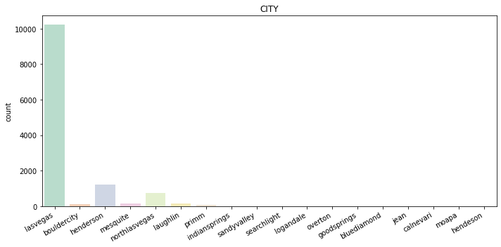
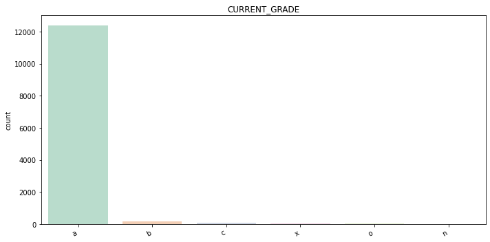
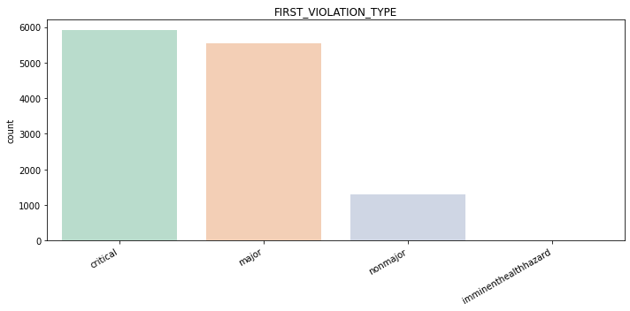
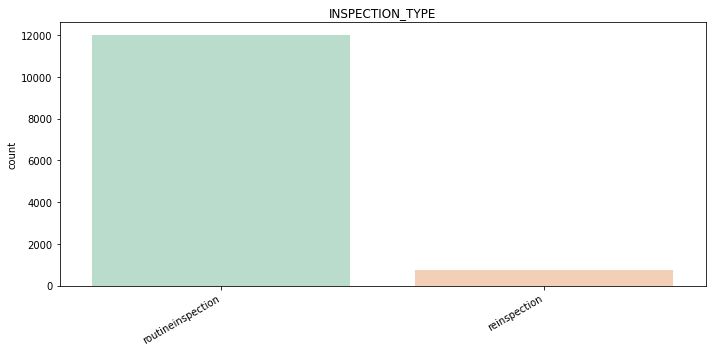
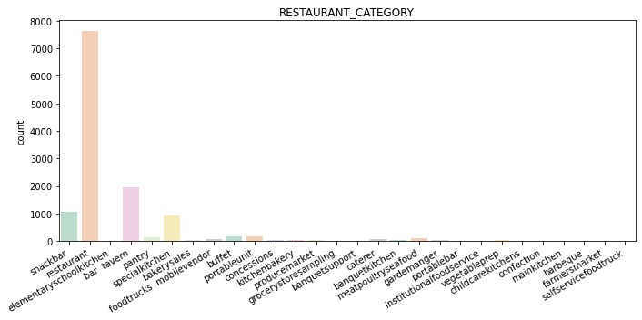

Also, investigating the correlation between class and each feature can help us to select the best features.

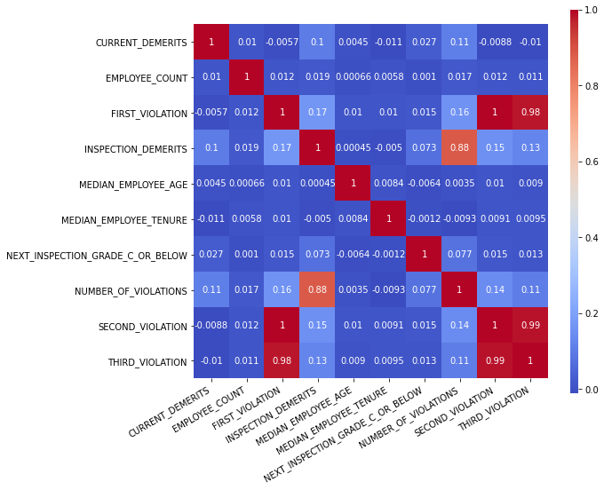
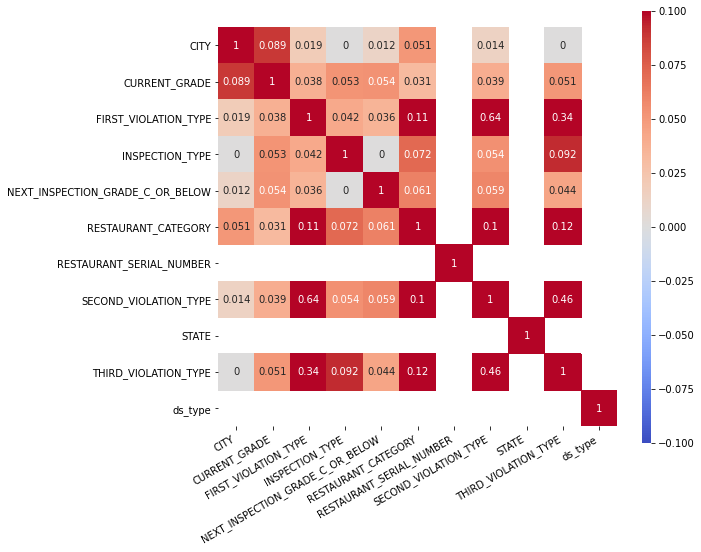

## Preprocessing
First, we need to delete the null values and detected outliers. Then, for numeric features we should look at their statistical information to detect outlier and remove them. 
```
CURRENT_DEMERITS
count     20272.000000
mean         49.105101
std        6249.369853
min         -37.000000
25%           0.000000
50%           5.000000
75%           8.000000
max      889787.000000
mode 0    0.0

EMPLOYEE_COUNT
count     20272.000000
mean         20.764180
std         782.703608
min          -7.000000
25%           8.000000
50%          14.658085
75%          21.262031
max      111447.000000
mode 0    3.0

INSPECTION_DEMERITS
count    20272.000000
mean        14.231255
std          8.657414
min          0.000000
25%          8.000000
50%         11.000000
75%         19.000000
max         86.000000
mode 0    10.0

NUMBER_OF_VIOLATIONS
count    20272.000000
mean         5.731946
std          3.017367
min          3.000000
25%          4.000000
50%          5.000000
75%          7.000000
max         42.000000
mode 0    3.0
```
We can create some filters to delete them.
```Python
    # Outlier handling     
    df = df[df['NEXT_INSPECTION_GRADE_C_OR_BELOW'].isin(["0", "1"])]     
    df = df[df['CURRENT_GRADE'].isin(["a", "b", "c", "x", "o", "n"])]
    df = df[df['INSPECTION_TYPE'].isin(["routineinspection", "reinspection"])] 
    df = df[(0 < df['FIRST_VIOLATION']) &  (df['FIRST_VIOLATION'] < 311)] 
    df = df[(0 < df['SECOND_VIOLATION']) &  (df['SECOND_VIOLATION'] < 311)] 
    df = df[(0 < df['THIRD_VIOLATION']) &  (df['THIRD_VIOLATION'] < 311)] 
    df = df[(0 <= df['CURRENT_DEMERITS']) &  (df['CURRENT_DEMERITS'] < 200)]  
    df = df[(0 < df['EMPLOYEE_COUNT']) &  (df['EMPLOYEE_COUNT'] < 100)]  
    df = df[df['STATE']=='nevada'] 
```
Afterwards, continus features should be discretized. Then, we normalize all the numeric features.

``` Python
    df_disc = pd.DataFrame()
    # Discretization
    for i in continuous_features:
        disc = pd.cut(df[i], bins=10, labels=np.arange(10), right=False)
        df_disc = pd.concat([df_disc, disc], axis=1)
        
    # Concatenate numeric features and discretized features
    for i in numeric_feactures:
        df_disc = pd.concat([df_disc, df[i]], axis=1)    
        
    # Normalization
    x = df_disc.values #returns a numpy array
    min_max_scaler = preprocessing.MinMaxScaler()
    x_scaled = min_max_scaler.fit_transform(x)
```

Then, we should binarize the nominal features.
```Python
for i in nominal_features:
        dummies = pd.get_dummies(df[i], prefix=i, drop_first=False)
        df_new = pd.concat([df_new, dummies], axis=1)
```
Now, the cleaned and preprocessed data is ready for the further process.

Before using this data in the model, we need to pay attention to the distribution of the class NEXT_INSPECTION_GRADE_C_OR_BELOW. Counting the number of zeros and ones, we can find that we have an imbalanced data.

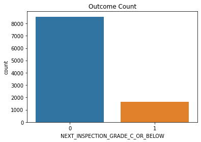

Therefore, we need to balance it using either under-sampling or over sampling.
If we consider under-sampling, totaly we have 4000 samples for training which is low.

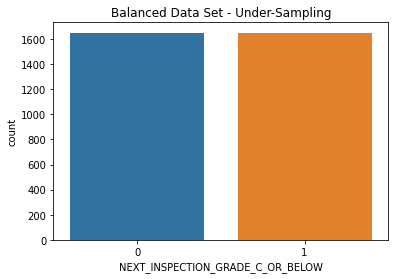

We will have around 22000 samples, if we perform over-sampling.

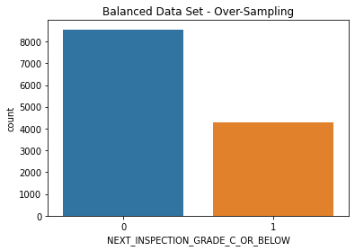

``` Python
# Visualize the classes distributions
sns.countplot(x=df['NEXT_INSPECTION_GRADE_C_OR_BELOW']).set_title("Outcome Count")
plt.show()

# Specify features columns
X = df_new

# Specify target column
y = df['NEXT_INSPECTION_GRADE_C_OR_BELOW']

# Import required library for resampling
from imblearn.under_sampling import RandomUnderSampler

# Instantiate Random Under Sampler
rus = RandomUnderSampler(random_state=42)

# Perform random under sampling
df_data, df_target = rus.fit_resample(X, y)

# Visualize new classes distributions
sns.countplot(df_target).set_title('Balanced Data Set - Under-Sampling')
plt.show()

# define oversampling strategy
from imblearn.over_sampling import RandomOverSampler
oversample = RandomOverSampler(sampling_strategy='minority')
df_data, df_target = oversample.fit_resample(X, y)

# Visualize new classes distributions
sns.countplot(df_target).set_title('Balanced Data Set - Over-Sampling')
plt.show()
```

We need to compare the results of all to be able to select the best fit for our data.

## Classifier selection 

To create the best model, we need to compare multiple classifier for our training set while considering normal, under-sampled, and over-sampled training set. To evaluate their results, I considered multiple performance evaluation metrics such as precision, recall, f1-score, log loss, coefficient matrix.

Since, we have an imbalanced data, classification accuracy is not a decent performance metric for comparing classifiers. However, we can consider this metric for overall performance of all classifiers using different re-sampling methods.

For the normal dataset (without re-sampling), MLP Classifier shows a bigger accuracy around 77% and log loss 2.72. However, none of classifiers cannot be reliable to be used in an MVP.

```
==============================
KNeighborsClassifier
****Results****
Accuracy: 80.3845%
[[2018  142]
 [ 358   31]]
              precision    recall  f1-score   support

           0       0.85      0.93      0.89      2160
           1       0.18      0.08      0.11       389

    accuracy                           0.80      2549
   macro avg       0.51      0.51      0.50      2549
weighted avg       0.75      0.80      0.77      2549

Log Loss: 3.292286639157181
==============================
SVC
****Results****
Accuracy: 84.7391%
[[2160    0]
 [ 389    0]]
              precision    recall  f1-score   support

           0       0.85      1.00      0.92      2160
           1       0.00      0.00      0.00       389

    accuracy                           0.85      2549
   macro avg       0.42      0.50      0.46      2549
weighted avg       0.72      0.85      0.78      2549

Log Loss: 0.4275959976690754
==============================
DecisionTreeClassifier
****Results****
Accuracy: 73.4798%
[[1812  348]
 [ 328   61]]
              precision    recall  f1-score   support

           0       0.85      0.84      0.84      2160
           1       0.15      0.16      0.15       389

    accuracy                           0.73      2549
   macro avg       0.50      0.50      0.50      2549
weighted avg       0.74      0.73      0.74      2549

Log Loss: 9.14647595674589
==============================
RandomForestClassifier
****Results****
Accuracy: 84.6607%
[[2153    7]
 [ 384    5]]
              precision    recall  f1-score   support

           0       0.85      1.00      0.92      2160
           1       0.42      0.01      0.02       389

    accuracy                           0.85      2549
   macro avg       0.63      0.50      0.47      2549
weighted avg       0.78      0.85      0.78      2549

Log Loss: 0.44338986014469206
==============================
XGBClassifier
****Results****
Accuracy: 83.9545%
[[2132   28]
 [ 381    8]]
              precision    recall  f1-score   support

           0       0.85      0.99      0.91      2160
           1       0.22      0.02      0.04       389

    accuracy                           0.84      2549
   macro avg       0.54      0.50      0.48      2549
weighted avg       0.75      0.84      0.78      2549

Log Loss: 0.44260914250532374
==============================
AdaBoostClassifier
****Results****
Accuracy: 84.7783%
[[2159    1]
 [ 387    2]]
              precision    recall  f1-score   support

           0       0.85      1.00      0.92      2160
           1       0.67      0.01      0.01       389

    accuracy                           0.85      2549
   macro avg       0.76      0.50      0.46      2549
weighted avg       0.82      0.85      0.78      2549

Log Loss: 0.6801756075640205
==============================
GradientBoostingClassifier
****Results****
Accuracy: 84.7391%
[[2158    2]
 [ 387    2]]
              precision    recall  f1-score   support

           0       0.85      1.00      0.92      2160
           1       0.50      0.01      0.01       389

    accuracy                           0.85      2549
   macro avg       0.67      0.50      0.46      2549
weighted avg       0.79      0.85      0.78      2549

Log Loss: 0.4215714679713038
==============================
GaussianNB
****Results****
Accuracy: 17.6540%
[[  74 2086]
 [  13  376]]
              precision    recall  f1-score   support

           0       0.85      0.03      0.07      2160
           1       0.15      0.97      0.26       389

    accuracy                           0.18      2549
   macro avg       0.50      0.50      0.16      2549
weighted avg       0.74      0.18      0.10      2549

Log Loss: 28.41813591281471
==============================
LinearDiscriminantAnalysis
****Results****
Accuracy: 84.5822%
[[2153    7]
 [ 386    3]]
              precision    recall  f1-score   support

           0       0.85      1.00      0.92      2160
           1       0.30      0.01      0.02       389

    accuracy                           0.85      2549
   macro avg       0.57      0.50      0.47      2549
weighted avg       0.76      0.85      0.78      2549

Log Loss: 0.4237382709676721
==============================
QuadraticDiscriminantAnalysis
****Results****
Accuracy: 17.7324%
[[  74 2086]
 [  11  378]]
              precision    recall  f1-score   support

           0       0.87      0.03      0.07      2160
           1       0.15      0.97      0.26       389

    accuracy                           0.18      2549
   macro avg       0.51      0.50      0.17      2549
weighted avg       0.76      0.18      0.10      2549

Log Loss: 28.3922664736903
==============================
MLPClassifier
****Results****
Accuracy: 76.7360%
[[1901  259]
 [ 334   55]]
              precision    recall  f1-score   support

           0       0.85      0.88      0.87      2160
           1       0.18      0.14      0.16       389

    accuracy                           0.77      2549
   macro avg       0.51      0.51      0.51      2549
weighted avg       0.75      0.77      0.76      2549

Log Loss: 2.7244204572891553
==============================
LogisticRegression
****Results****
Accuracy: 57.4735%
[[1222  938]
 [ 146  243]]
              precision    recall  f1-score   support

           0       0.89      0.57      0.69      2160
           1       0.21      0.62      0.31       389

    accuracy                           0.57      2549
   macro avg       0.55      0.60      0.50      2549
weighted avg       0.79      0.57      0.63      2549

Log Loss: 0.6777486205872061
==============================
```

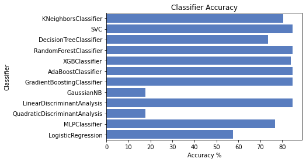
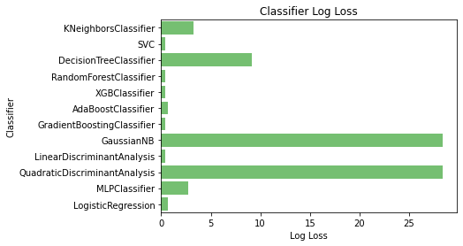

I tested many under- and over-sampling methods. But, under-sampling results show a weaker performance by decreasing the overall accuracy and increasing the log loss for some classifiers. Obviously, it happens because we have a training set with small number of samples.

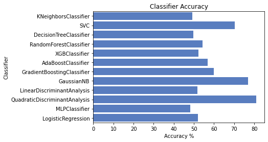
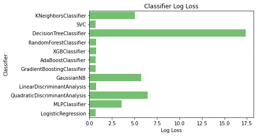

However, over-sampling can slightly improve the performance of some classifiers like MLP and Logistic Regression.

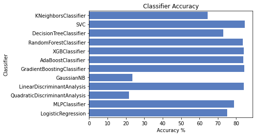
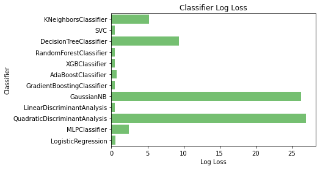

```
==============================
MLPClassifier
****Results****
Accuracy: 78.7368%
[[1955  205]
 [ 337   52]]
              precision    recall  f1-score   support

           0       0.85      0.91      0.88      2160
           1       0.20      0.13      0.16       389

    accuracy                           0.79      2549
   macro avg       0.53      0.52      0.52      2549
weighted avg       0.75      0.79      0.77      2549

Log Loss: 2.440638820655818
==============================
LogisticRegression
****Results****
Accuracy: 75.1667%
[[1823  337]
 [ 296   93]]
              precision    recall  f1-score   support

           0       0.86      0.84      0.85      2160
           1       0.22      0.24      0.23       389

    accuracy                           0.75      2549
   macro avg       0.54      0.54      0.54      2549
weighted avg       0.76      0.75      0.76      2549

Log Loss: 0.5433866874964954
==============================
```

Looking into classifiers' coefficient matrix, we can see that Logistic Regression is the best predictor among others, based on our data. However, it still is not reliable because its accuracy in predicting ones is 23% that is too low.

|Classifier|Accuracy|Log Loss|TP|FP|FN|TN|
|---|---|---|---|---|---|---|
|K Neighbors|64.3390%|5.205270370691901|1513|647|262|127|
|SVM|84.7391%|0.4555404018042387|2160|0|389|0|
|Decision Tree|72.8521%|9.376552869861982|1790|370|322|67|
|Random Forest|83.5230%|0.4567697501519537|2116|44|376|13|
|XGB|83.9937%|0.4422651429394996|2130|30|378|11|
|AdaBoost|83.8368%|0.6847053123569384|2133|27|385|4|
|Gradient Boosting|84.2683%|0.4367792398677354|2145|15|386|3|
|Gaussian NB|23.4994%|26.276843893714485|248|1912|38|351|
|Linear Discriminant Analysis|84.1899%|0.4405887425481297|2193|21|382|7|
|Quadratic Discriminant Analysis|21.6556%|26.995990555345397|198|1962|35|354|
|MLP ANN|78.7368%|2.440638820655818|1955|205|337|52|
|Logistic Regression|75.1667%|0.5433866874964954|1823|337|296|93|

I also applied the multiple classifier on the training dataset using Orange software, but the results was close to the table above. 

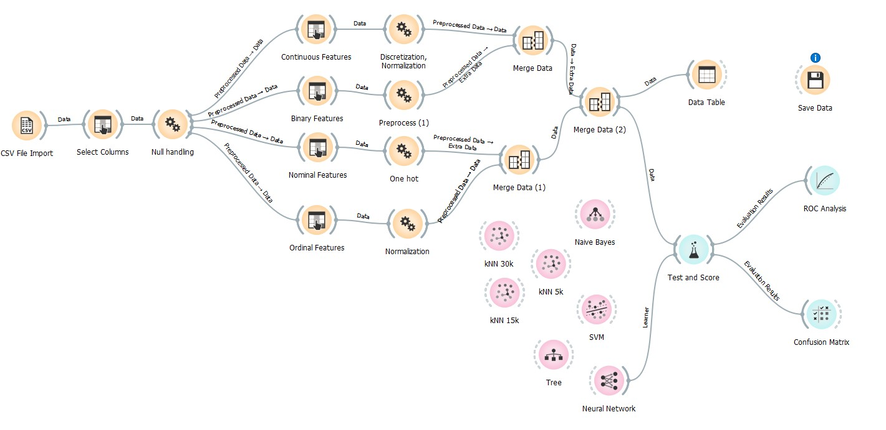


## Recommendations

Based on the provided dataset and information, building a reliable MVP model is **not recommended**. The main reason is that the dataset is imbalanced, and it is skewed to the class zero. The small size of training-set makes it difficult to use re-sampling methods for data balancing purpose. Also, there are more than 20% missing value and outlier in the dataset leads to decrease the size of applicable training-set.

To mitigate the skewed dataset, the best way is to collect more data which has both class zero and one. The other solution is to use more related features. According to the correlation figures provided in the analysis section, there is a strong correlation between the class NEXT_INSPECTION_GRADE_C_OR_BELOW and features FIRST_VIOLATION, SECOND_VIOLATION, and THIRD_VIOLATION. Hence, having more features like these features can improve the accuracy of the model. I believe that it is possible since we have feature VIOLATIONS_RAW that contain the track of violations. In the provided dataset, this feature cannot be used because it contains some codes which are unclear (further information is needed). Having knowledge about VIOLATIONS_RAW and exploiting this feature in the prediction model can significant improve the model's performance. On the other hand, providing some accurate formula for calculating INSPECTION_DEMERITS and CURRENT_GRADE can prevent lots of missing data and outliers cause by these features. Furthermore, since violation types FIRST_VIOLATION_TYPE, SECOND_VIOLATION_TYPE, and THIRD_VIOLATION_TYPE are highly correlate with outcome, providing more detail about further levels (e.g., 4th, 5th) can increase the model's performance. Having the duration between previous and current inspection may also be helpfull.
